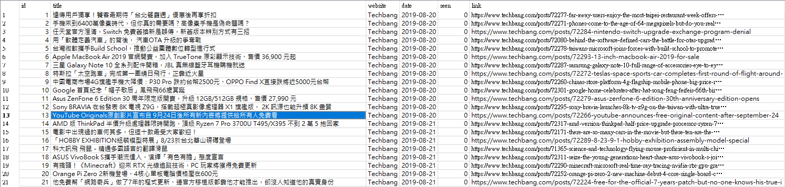
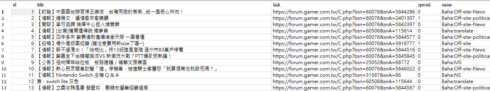
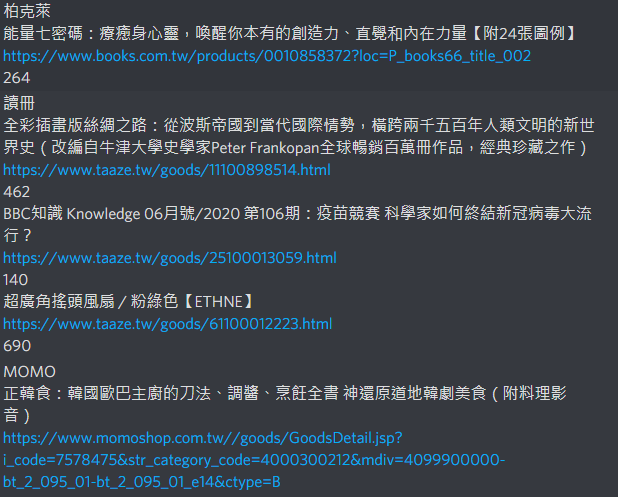
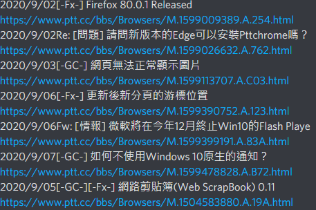

從資料庫中取得每個任務的執行時間並安排好行程，將執行後的結果儲存入資料庫中，另外儲存通知的訊息內容(用於DiscordBot）。

任務內容有：

1. 爬新聞資訊 - 爬取文章直到有重複的內容
2. 爬巴哈姆特文章 - 過濾重複文章以及GP數量
3. 爬書籍資訊 - 顯示特價書籍資訊
4. PTT文章 - 顯示二手交易以及其他看板文章
5. 發送個人提醒訊息
6. 定期整理資料庫（刪除重複資料）

新聞爬取結果如下圖所示，以及其欄位：
title：文章標題
website：來源網站
date：日期
seen：觀看狀態（用於個人網站中過濾文章使用，0代表未顯示於網站中,1代表點擊過連結,2代表顯示於網站過）
link：文章網址

巴哈姆特文章爬取結果如下圖所示，以及其欄位：
title：文章標題
link：文章網址
special：特別文章（當GP數量超過一定數量即為特別文章），用於整理資料庫時
name：文章來源看板

書籍爬取結果如下圖所示：
顯示書籍網站來源
書名
連結網址
價格

PTT文章爬取結果如下圖所示：
顯示文章標題與日期
連結網址

